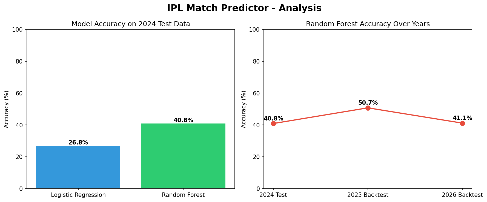

# IPL Match Predictor with Backtesting

A Machine Learning project that predicts IPL match winners trained on
18 seasons of data (2008-2024) and backtested on IPL 2025 & 2026.

## Project Highlights
- Trained on **1019 matches** across 18 IPL seasons
- Achieved **50.7% accuracy** on IPL 2025 backtest
- **Correctly predicted RCB winning both IPL 2025 & 2026 Finals**
- Backtested on real match results — not just test data

## Tech Stack
Python | Pandas | NumPy | Scikit-learn | Matplotlib

## ML Models Used
| Model | 2024 Accuracy |
|-------|--------------|
| Logistic Regression | 26.8% |
| Random Forest | 40.8% |

## Backtesting Results
| Season | Accuracy | Final Prediction |
|--------|----------|-----------------|
| 2024 Test | 40.8% | — |
| 2025 Backtest | 50.7% | RCB ✅ Correct! |
| 2026 Backtest | 41.1% | RCB ✅ Correct! |

## Features Used
- Team 1 & Team 2
- Toss winner & decision
- Venue
- Home ground advantage (domain knowledge)
- Season
- Match type (playoff vs league)
- All-time team win rate
- Recent 2-season win rate

## Key Insights
- Random Forest outperforms Logistic Regression by ~14%
- Home ground advantage is a significant predictor
- Recent form (last 2 seasons) improves accuracy over all-time win rate
- Model correctly predicted RCB's championship run in both 2025 & 2026

## Project Structure
```
ipl-match-predictor/
│
├── data/
│   ├── matches/          ← 2008-2024 dataset
│   ├── ipl_2025/         ← IPL 2025 dataset
│   └── ipl_2026/         ← IPL 2026 dataset
├── visuals/
│   └── ipl_analysis.png  ← generated charts
└── ipl_predictor.ipynb   ← main notebook
```

##  How to Run

### 1. Clone the repository
```
git clone https://github.com/jayanthguntuku/ipl-match-predictor.git
cd ipl-match-predictor
```

### 2. Install required libraries
```
pip install pandas numpy scikit-learn matplotlib
```

### 3. Download datasets
- 2008-2024: https://www.kaggle.com/datasets/patrickb1912/ipl-complete-dataset-20082020
- IPL 2025: https://www.kaggle.com/datasets/tanishqjoshi16/ipl-2025-data-set
- IPL 2026: https://www.kaggle.com/datasets/ankit0071/ipl-2026-data

### 4. Run the notebook
- Open VS Code
- Open `ipl_predictor.ipynb`
- Select Python kernel
- Run all cells top to bottom

## 📈 Sample Charts

